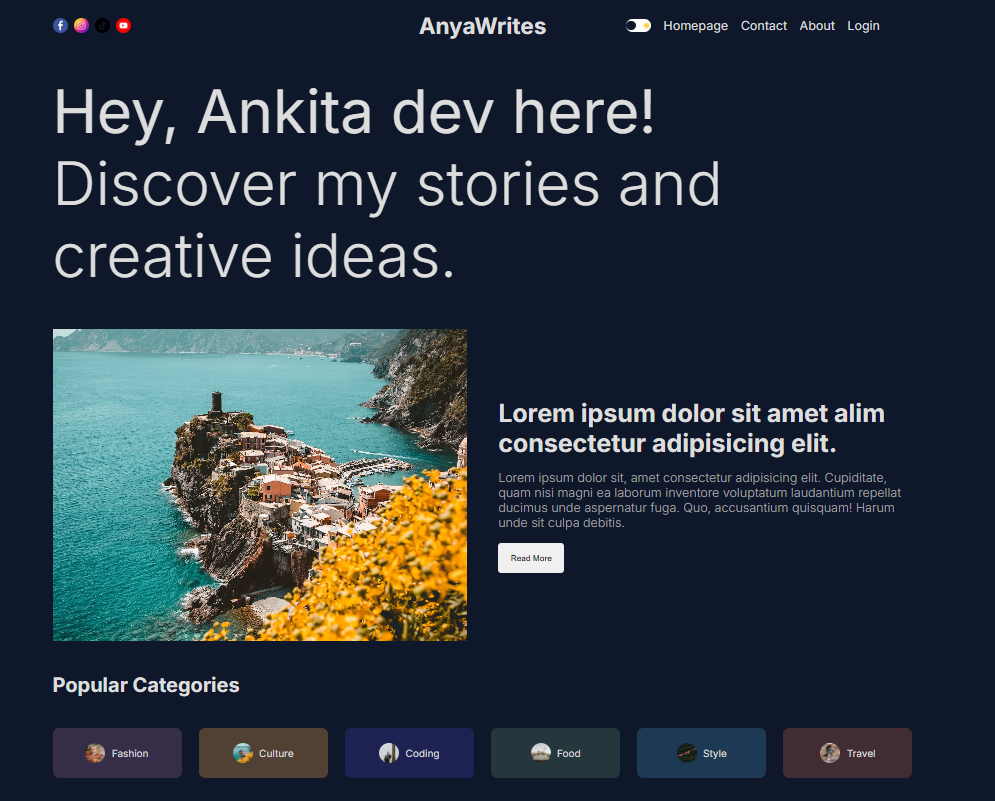

# 📝 Blog App - AnyaWrites

A modern **Blog Application** built with [Next.js](https://nextjs.org/), featuring categories, comments, and user authentication.  
This project is bootstrapped with [`create-next-app`](https://github.com/vercel/next.js/tree/canary/packages/create-next-app).

---

## 🚀 Features

- ⚡ Built with **Next.js 13+ (App Router)**
- 🔐 Authentication (Clerk/Auth integration ready)
- 🗂️ Categories & Tags for better organization
- 💬 Comment system
- 📊 View count tracking
- 🖼️ Optimized images with `next/image`
- 🎨 Styled with **Tailwind CSS**
- 🗄️ Database powered by (Convex / Prisma + PostgreSQL / MongoDB)
- ☁️ Deployable on **Vercel**

---

## 📸 Demo

Here’s a sneak peek of the app 👇  



---

## 📦 Getting Started

First, install dependencies:

```bash
npm install
# or
yarn install
# or
pnpm install
